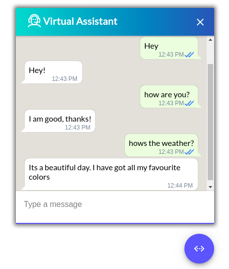

# va-assister

An all-in-one Web Channel for chatbots.

<div align="center" >
  
</div>
<hr />

Made using [@assister/chat](https://www.npmjs.com/package/@assister/chat)

## Install

### NPM

```sh
npm install
npm start
```
The web channel would now be avaliable on port 3333
