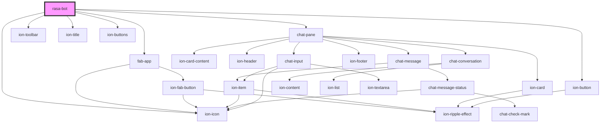

# rasa-bot

<!-- Auto Generated Below -->

## Properties

| Property       | Attribute      | Description         | Type                          | Default       |
| -------------- | -------------- | ------------------- | ----------------------------- | ------------- |
| `conversation` | `conversation` |                     | `string`                      | `uuidv4()`    |
| `gap`          | `gap`          |                     | `"long" \| "none" \| "short"` | `'long'`      |
| `header`       | `header`       |                     | `string`                      | `'Assistant'` |
| `server`       | `server`       | Rasa server address | `string`                      | `undefined`   |

## Dependencies

### Depends on

- fab-app
- chat-pane
- ion-toolbar
- ion-title
- ion-buttons
- ion-button
- ion-icon

### Graph

----------------------------------------------

*Built with [StencilJS](https://stenciljs.com/)*
